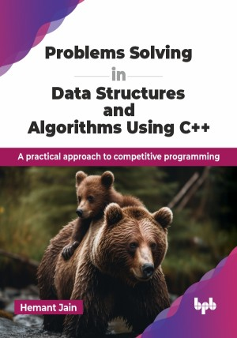

# Problems Solving in Data Structures and Algorithms Using C++

A practical approach to competitive programming.

This is the repository for [Problems Solving in Data Structures and Algorithms Using C++
](https://bpbonline.com/products/problems-solving-in-data-structures-and-algorithms-using-c?variant=44193538867400),published by BPB Publications.

## About the Book
The book “Problem Solving in Data Structures and Algorithms Using C++" is designed to equip readers with a solid foundation in data structures and algorithms, essential for both academic study and technical interviews. 

It provides a solid foundation in the field, covering essential topics such as algorithm analysis, problem-solving techniques, abstract data types, sorting, searching, linked lists, stacks, queues, trees, heaps, hash tables, graphs, string algorithms, algorithm design techniques, and complexity theory. The book presents a clear and concise explanation of each topic, supported by illustrative examples and exercises. It progresses logically, starting with fundamental concepts and gradually building upon them to explore more advanced topics. The book emphasizes problem-solving skills, offering numerous practice problems and solutions to help readers prepare for coding interviews and competitive programming challenges. Each problem is accompanied by a structured approach and step-by-step solution, enhancing the reader's ability to tackle complex algorithmic problems efficiently.

By the end of the book, readers will have a strong understanding of algorithms and data structures, enabling them to design efficient and scalable solutions for a wide range of programming problems. 

## What You Will Learn
• Master algorithmic techniques for sorting, searching, and recursion.

• Solve complex problems using dynamic programming and greedy algorithms.

• Optimize code performance with efficient algorithmic solutions.

• Prepare effectively for coding interviews with real-world problem sets.

• Develop strong debugging and analytical problem-solving skills.
